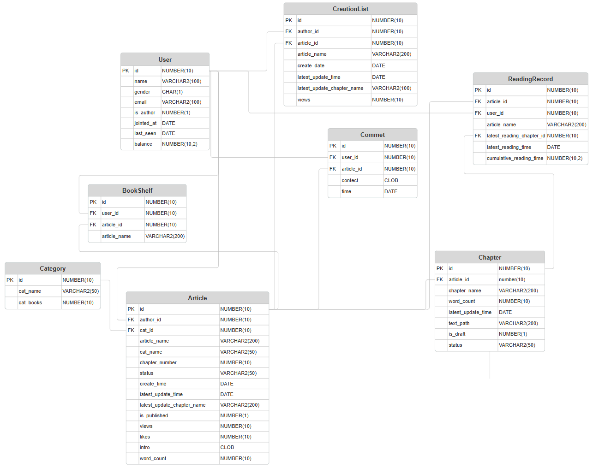

## 目前搭建的基础框架如下

```
/novel_heaven
  ├── app/
  │   ├── __init__.py
  │   ├── models.py
  │   ├── routes/
  │   │   ├── auth/
  │   │   │   ├── __init__.py
  │   │   │   ├── currency.py   # 货币系统
  │   │   │   ├── history.py    # 历史阅读记录
  │   │   │   ├── routes.py
  │   │   │   └── forms.py
  │   │   ├── articles/
  │   │   │   ├── __init__.py
  │   │   │   ├── routes.py
  │   │   │   └── forms.py
  │   │   └── main/
  │   │       ├── __init__.py
  │   │       └── routes.py
  │   ├── templates/
  │   │   ├── base.html
  │   │   ├── auth/
  │   │   │   ├── login.html
  │   │   │   └── register.html
  │   │   ├── articles/
  │   │   |   ├── publish.html
  │   │   |   └── article.html
  |   |   └── main/
  │   │       ├── dashboard.html
  │   │       └── index.html
  │   └── static/
  │       ├── css/
  │       │   └── main.css
  │       └── js/
  │           └── main.js
  ├── config.py
  └── run.py
```
- app.init创建Flask app，注册蓝本
- 蓝本目前包括了3块内容：main auth article
    - main搭建基础内容，如路由转移到登录页面index.html，其他基础功能待实现
    - auth负责用户管理，连接登录页面，处理用户信息，功能待实现
    - articles负责文章内容管理，连接发表、阅读页面，处理文章内容等等，功能待实现
- 注：app/route之下的内容为路由以及基础功能调用，文件夹可根据对象的创建进行增减，只需各对象功能独立，互不干扰
- app/models是数据库模型设计
- config.py基础配置，包括数据库连接路径等等


## 前端需要负责的页面：
1. 主页面index.html，有登录选项
2. 用户登录页面：登录成功，登录失败重新登录
3. 书架页面
4. 书籍搜索
5. 书籍元信息显示
6. 阅读页面
7. 作者创作页面

## 数据库当前设计：


其他可自行设计